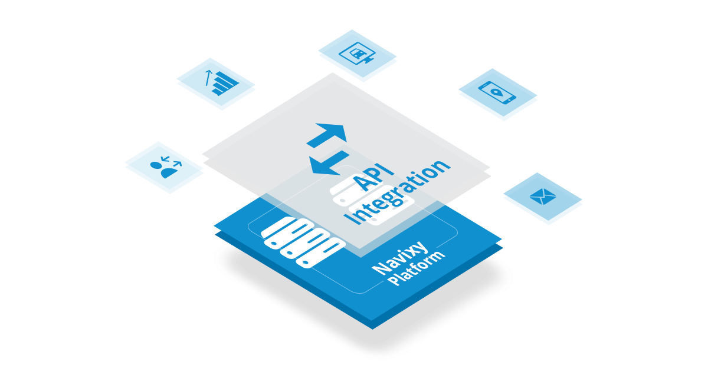

# Navixy Developer Documentation

[Navixy](https://navixy.com) is a comprehensive GPS / Vehicle telematics platform developed by [SquareGPS](https://squaregps.com). This documentation provides detailed information on integrating third-party solutions with the Navixy platform, including API and technical documentation tailored for developers and partners.

## Getting Started

### How to Read This Documentation

The documentation is organized into several sections, each addressing a specific aspect of the Navixy platform:

* [**General**](../general/getting-started.md) - Introduction to the documentation, Navixy API Sandbox, usage instructions, and contribution guidelines.
* [**Backend API**](../backend-api/getting-started/introduction.md) - API calls for user interface functionalities like tracking, reports, and tasks.
* [**Panel API**](../panel-api/getting-started.md) - API calls for admin panel functionalities such as device management, user plans, and user information.
* [**Eco Fleet API**](../eco-fleet-api/getting-started.md) - API calls for efficient fuel management.
* [**Data Warehouse API**](../data-warehouse-api/getting-started.md) - API calls for obtaining raw IoT / Telematics data.
* [**Frontend**](../frontend/extensions/user-applications.md) - Customizing the welcome page, integrating custom apps into Navixy UI, and using the Delivery plugin.

Navigate between sections using the top menu. You can also download a PDF version of the documentation and find a link to our GitHub page on the right side of the menu.

Each section's files are listed in the left-hand menu. Click on a file to display its contents. An internal menu on the right side of the page provides quick navigation within the file.

#### Documentation Structure

The documentation includes three types of files: documents, guides, and API calls. Documents and guides are divided into semantic parts, starting with an introduction that summarizes the content.

#### API Call Structure

* **Introduction** - General information and purpose of the API call.
* **Object Structure** - Describes the object structure used in the calls (optional).
* **API Actions** - Base API call and associated actions, including:
    * **Action Description** - Purpose of the API action.
    * **Requirements** - Necessary permissions (optional).
    * **Parameters Table** - Lists parameters for the API call with descriptions and data types.
    * **Examples** - Correct API call examples with parameters. Includes a copy button for easy use.
    * **Response** - Example of a successful server response with field descriptions.
    * **Errors** - Specific errors related to the API action, plus a general error list.

## API Limits

To ensure system stability for all users, the platform limits API requests to 50 requests per second per user and per IP address (for applications serving multiple users). These limits are applied based on user session hash and API keys.

## Navixy API Sandbox

Navixy provides a powerful Postman collection, the Navixy API Sandbox, for working with API documentation, exploring, and testing API queries using real or demo data. This collection offers a familiar environment for many developers and simplifies the process of building customized solutions. 

For detailed information on using Postman with Navixy, please refer to the [Postman Guide](./postman.md).

## Get Involved

Contribute to improving the [Navixy Platform documentation](../general/contribute/dev-docs.md) or assist with [translations](../general/contribute/translation.md). Your participation helps make the Navixy platform even better for the developer community.